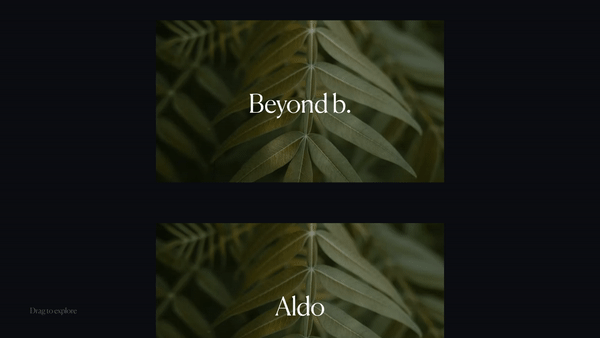
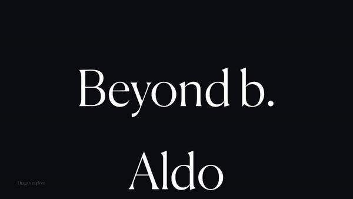
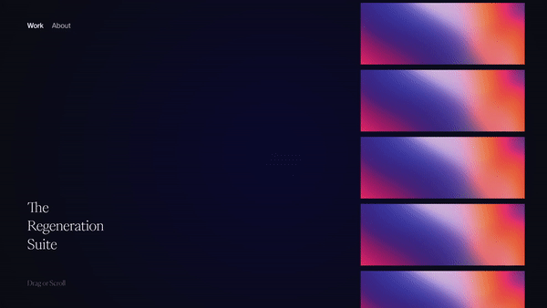

# Slider Experiments

## ✌ About this project

This is a project that started with my obsession with sliders. I wanted to know how they worked and to create all types of sliders by my own.

### Installation

```bash
# Clone the repo on you local machine
git clone git@github.com:deepak-gangwar/slider-experiments.git

# To install dependencies
npm install

# To start a dev server locally
npm run dev

# To build the project (output in public folder)
npm run build
```

### 👻 Sliders

> Following are mentioned sliders with their commits and demo gifs.
> To try any one of them, check code of the respective commit.

#### Slider 1

Simple horizontal slider
<br />
<br />


#### Slider 2

Horizontal slider with snap

#### Slider 3

Simple vertical slider
<br />
<br />


#### Slider 4

Slider like Nahel Moussi (but not infinite)
<br />
<br />


#### Slider 5

Scroll controls are added to the above slider. Commit 2d2a202

#### Slider 6

Simple side slider for web project
<br />
<br />


#### Slider 7

Slick webgl slider. Design based on above slider with WebGL shader effects incorporated.
<br />
<br />

